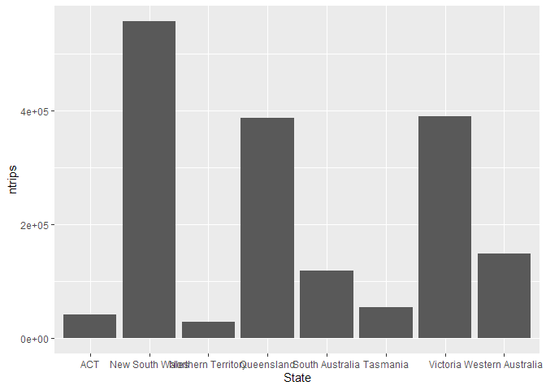

Domestic Trips Exploration
================
Jack McGrath
29/11/2021

## Loading Libraries

``` r
library(tidyverse)
library(lubridate)
```

## Importing Data

``` r
data <- read_csv("data/clean_trips.csv")
data
```

    ## # A tibble: 24,320 x 5
    ##    Quarter    Region          State           Purpose   Trips
    ##    <date>     <chr>           <chr>           <chr>     <dbl>
    ##  1 1998-03-01 Sydney          New South Wales Holiday  828.  
    ##  2 1998-03-01 Sydney          New South Wales Visiting 818.  
    ##  3 1998-03-01 Sydney          New South Wales Business 525.  
    ##  4 1998-03-01 Sydney          New South Wales Other    117.  
    ##  5 1998-03-01 Blue Mountains  New South Wales Holiday  104.  
    ##  6 1998-03-01 Blue Mountains  New South Wales Visiting  70.5 
    ##  7 1998-03-01 Blue Mountains  New South Wales Business  18.8 
    ##  8 1998-03-01 Blue Mountains  New South Wales Other      2.48
    ##  9 1998-03-01 Capital Country New South Wales Holiday   99.2 
    ## 10 1998-03-01 Capital Country New South Wales Visiting 100.  
    ## # ... with 24,310 more rows

## Exploration

``` r
data %>% group_by(State) %>% 
  summarise(ntrips = sum(Trips)) %>% 
  ggplot() +
  geom_col(aes(x = State, y = ntrips))
```

<!-- -->
